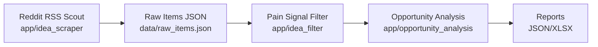

# ROADMAP

Last updated: 2026-03-01
Current branch: sourceScout
Current phase: Restructure to app/agents architecture (Reddit-first)

## Milestone Tracker

Progress: **2 / 6 complete**

| Milestone | Status | Notes |
|---|---|---|
| M1 Source Scout MVP | DONE | Initial raw item collection implemented |
| M2 Restructure to new architecture | DONE | Core code moved/reused in `app/` and `agents/` |
| M3 Reddit-only run path stabilization | IN PROGRESS | Compatibility wrapper retained in `skills/source_scout/run.py` |
| M4 LLM Pain Signal skill | PLANNED | To be implemented in `app/idea_filter/` |
| M5 Opportunity analysis/ranking | PLANNED | To be implemented in `app/opportunity_analysis/` |
| M6 Reporting & automation | PLANNED | JSON + XLSX + schedule |

## High-Level Architecture

## Change Log

- 2026-03-01: Started restructure to app/agents-based layout.
- 2026-03-01: Migrated/reused Reddit scraping and model logic.
- 2026-03-01: Added new entrypoints and compatibility wrapper.

## Next Actions

1. Add LLM-powered pain signal evaluator (OpenAI-backed).
2. Add ranked opportunity analysis output.
3. Add XLSX export and scheduler.
