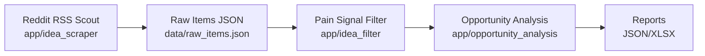

# ROADMAP

Last updated: 2026-03-09
Current branch: sourceScout
Current phase: Provider-agnostic LLM integration (OpenAI + local Ollama)

## Milestone Tracker

Progress: **4 / 6 complete**

| Milestone | Status | Notes |
|---|---|---|
| M1 Source Scout MVP | DONE | Initial raw item collection implemented |
| M2 Restructure to new architecture | DONE | Core code moved/reused in `app/` and `agents/` |
| M3 Reddit-only run path stabilization | DONE | New and compatibility entrypoints validated |
| M4 LLM Pain Signal skill | DONE | Provider-based LLM client supports OpenAI + Ollama with same I/O contract and tests |
| M5 Opportunity analysis/ranking | PLANNED | To be implemented in `app/opportunity_analysis/` |
| M6 Reporting & automation | PLANNED | JSON + XLSX + schedule |

## High-Level Architecture

## Change Log

- 2026-03-01: Started restructure to app/agents-based layout.
- 2026-03-01: Migrated/reused Reddit scraping and model logic.
- 2026-03-01: Added new entrypoints and compatibility wrapper.
- 2026-03-02: Integrated OpenAI-backed `LLMClient` with prompt/schema normalization and fallbacks.
- 2026-03-02: Added config/env controls and unit tests for evaluator + LLM client.
- 2026-03-09: Refactored `LLMClient` to provider-based routing (`LLM_PROVIDER`) with local Ollama support (`OLLAMA_*` env settings).
- 2026-03-09: Preserved evaluator input/output contract while adding robust JSON parsing for model responses.
- 2026-03-09: Expanded tests for Ollama success/error paths and provider selection behavior; updated README setup docs.

## Documentation Sync Rule (Task Closeout)

For every completed feature/fix task, update both docs in the same change set:

1. `README.md`: user-facing run/setup/usage changes.
2. `ROADMAP.md`: milestone status, changelog entry, and next actions.

This is now part of done criteria for future task completion.

## Next Actions

1. Add ranked opportunity analysis output.
2. Add XLSX export and scheduler.
3. Add optional local benchmarking across models (e.g., qwen variants) for pain-signal quality tuning.
